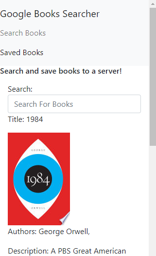

# parkers-googlebooks
Fullstack app to get books from the googlebooks api and save them to a database.

[Link to repository](https://github.com/MorgansPlayGames/parkers-googlebooks)

[Live Website](https://parkers-googlebooks.herokuapp.com/)

1. [ Description. ](#description)
2. [ Technology Used.](#technology-used)
2. [ Installation ](#installation-instructions)
3. [ Usage Information ](#usage-information)
4. [ Contribution Guidelines ](#contribution-guidelines)
5. [ Licence ](#licence)
6. [ Questions ](#questions?)

## Description:
    Full stack webpage to search for books on google using their API and saving that data to a mongo server to have access to later.

## Technology Used
    JS
    Mongo
    React:
        Axios
        React-Router-Dom
    Node:
        Express
        Mongoose
        M

### Installation Instructions
    Have a Mongodb installed and running
    Download
    'npm install' to install dependancies.
    'npm start' or 'node server.js'  
 
### Usage Information
    On run, the webpage can be used to search books on the google api and save books to a mongoDB

### Contribution Guidelines
    Fork, update, and
    Submit your code to me!

### Licence 
    Copyright (c) 2020, Parker Morgan
    All rights reserved.
        
    This source code is licensed under the MIT-style license found in the
    LICENSE file in the root directory of this source tree.

### Questions?
    GitHub: MorgansPlayGames
    Email: jpmaster13@msn.com